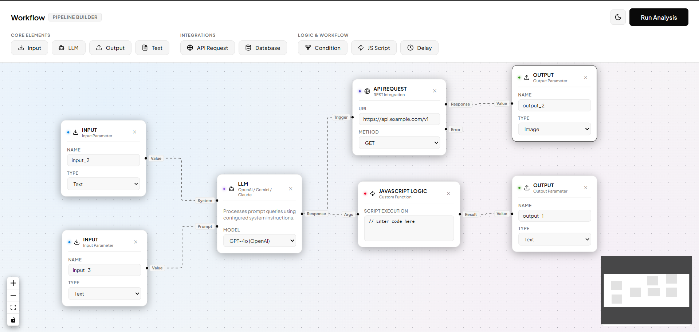

# Agent Workflow Builder

A drag-and-drop web application that allows users to design, build, and analyze workflow pipelines consisting of various nodes (Inputs, Outputs, Text, LLMs, Databases, APIs, etc.).



---

## Project Structure

The project is divided into two parts:
1. **Frontend**: Built with React, ReactFlow, and Tailwind CSS / Vanilla CSS.
2. **Backend**: Built with Python, FastAPI, and Pydantic.

```text
├── backend/
│   ├── app/
│   │   ├── models/
│   │   │   └── pipeline.py # Pydantic schemas (Node, Edge, Pipeline)
│   │   ├── routers/
│   │   │   └── pipelines.py # Pipeline router (/pipelines/parse)
│   │   ├── services/
│   │   │   └── graph.py     # Graph processing logic (is_dag, node/edge parsing)
│   │   └── main.py         # Core FastAPI App instance, middleware & router inclusion
│   ├── main.py             # Entrypoint wrapper (for backward compatibility)
│   └── requirements.txt    # Python dependencies
├── frontend/
│   ├── public/             # Static assets
│   ├── src/
│   │   ├── components/     # App-level UI components
│   │   ├── nodes/          # Component definitions for flow builder nodes
│   │   │   ├── components/ # Individual Node implementations (LLM, Input, Database, etc.)
│   │   │   ├── BaseNode.js # Shared node card layout & styles
│   │   │   └── registry.js # Registry for node configurations
│   │   ├── store/          # Zustand store for node & edge state management
│   │   └── App.js          # Entry layout
│   └── package.json
└── README.md               # Main instructions
```

---

## Features Implemented

- **Node Abstraction**: Standardized `BaseNode` interface to easily create, style, and manage workflow components.
- **Customizable Nodes**:
  - **Input Node**: Configurable parameters (Text, File) and names.
  - **Output Node**: Configurable output parameters.
  - **LLM Node**: Added a custom **Model selection dropdown** support (GPT-4o, Gemini 1.5 Pro, Claude 3.5 Sonnet, etc.) linked to the node state.
  - **Database Node**: Select databases (PostgreSQL, MySQL, SQLite, MongoDB) and edit SQL queries.
  - **Other Nodes**: Scripting (JS Code), API requests, Delay timers, and Conditionals.
- **DAG Parsing (Backend Integration)**: Validates if the pipeline is a Directed Acyclic Graph (DAG) and counts total nodes and edges using Kahn's topological sort algorithm.

---

## How to Run the Application

### 1. Running the Backend

The backend is built with Python 3 and FastAPI.

1. Navigate to the backend directory:
   ```bash
   cd backend
   ```

2. Create and activate a virtual environment (recommended):
   ```bash
   # Windows
   python -m venv .venv
   .\.venv\Scripts\activate

   # macOS/Linux
   python3 -m venv .venv
   source .venv/bin/activate
   ```

3. Install dependencies:
   ```bash
   pip install -r requirements.txt
   ```

4. Start the FastAPI development server:
   ```bash
   uvicorn main:app --reload --port 8001
   ```
   The backend will be running at [http://localhost:8001](http://localhost:8001).

### 2. Running the Frontend

The frontend is built with React and ReactFlow.

1. Navigate to the frontend directory:
   ```bash
   cd ../frontend
   ```

2. Install node dependencies:
   ```bash
   npm install
   ```

3. Start the React development server:
   ```bash
   npm start
   ```
   The frontend will be running at [http://localhost:3000](http://localhost:3000).

---

## Usage Guide

1. Drag nodes from the top toolbar categories (Core Elements, Integrations, Logic & Workflow) onto the canvas workspace.
2. Configure settings inside the nodes (e.g. choose the target model from the dropdown inside the LLM node, type queries, change types).
3. Connect the output handle of one node to the input handle of another node.
4. Click **Submit** in the top right header to analyze the graph structure.
5. An alert will display the number of nodes, number of edges, and whether the pipeline is a Directed Acyclic Graph (DAG).
